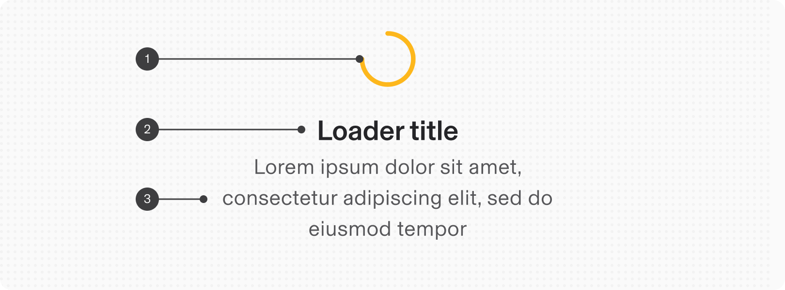
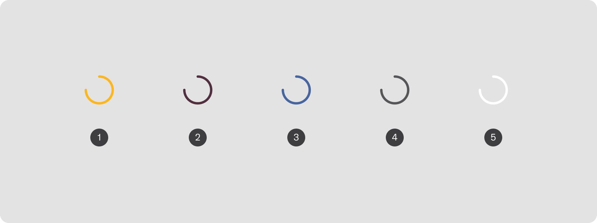
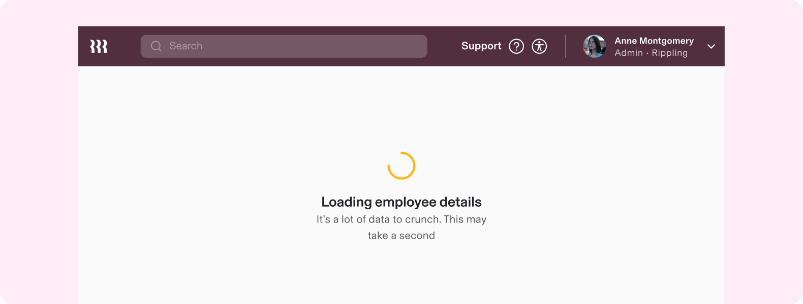
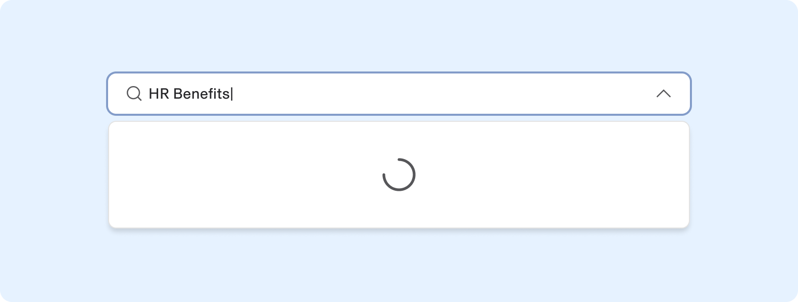

# Spinner

**Source:** [View in Confluence](https://rippling.atlassian.net/wiki/spaces/RDS/pages/3908894879)  
**Last Synced:** 11/3/2025, 6:10:22 PM  
**Confluence Version:** 6

---

Introduction

A progress indicator for communicating that a process or task is currently underway without a known completion time.

---

# Overview

-   Useful for assuring a user that the system is “busy” loading a requested resource and content is on the way
    
-   Well suited when space is limited vertically and horizontally, such as in buttons, menus, and cards
    

## Resources

**Type**

**Resource**

**Status**

Design

[Web Component (Figma)](https://www.figma.com/file/ysWbTtfWqhVDHQd1Mg2LQ1/Component-Library-v2?type=design&node-id=1005-3039&mode=design)

AVAILABLEGreen

Implementation

[Web Component (Storybook)](https://uikit.ripplinginternal.com/?path=/docs/components-miscellaneous-spinner--props)

AVAILABLEGreen

---

# Specs

## Anatomy

1.  Loading animation
    
2.  Title (optional)
    
3.  Description (optional)
    

## Configuration

### Appearance

1.  Secondary (default)
    
2.  Primary
    
3.  Tertiary
    
4.  Neutral
    
5.  Inverse
    

### Size

1.  Extra extra small
    
2.  Extra small
    
3.  Small
    
4.  Medium (default)
    
5.  Large
    
6.  Extra large
    

---

# Usage

### When to use

-   Great for providing **immediate** feedback to an action that prompts asynchronous operations
    
-   During any process or task where the completion time is unknown or may vary, such as loading page content, submitting a form, or initializing an application
    

### When to use something else

-   For processes with a known time to completion, consider using a Progress Bar that provides real-time feedback on how much of the task is complete and how much time remains
    
-   When the page content or layout can be estimated, consider a Field Loader instead. This helps mitigate layout shift and provide a less jarring loading experience for the user
    

## Guidelines

### Center Spinners in their associated container

By placing the spinner at the center of the user's viewport or relevant container, it becomes the focal point, clearly indicating that an action is underway. Plus, centering the Spinners provides visual balance and symmetry during transitions, contributing to a smoother and more polished user experience.

---

# Accessibility

Users should be able to:

-   Understand what progress the indicator is communicating
    

## Labeling elements

Because the loading animation is a visual cue, it needs an accessibility label to assist people who can't rely on visuals.

Be sure to write an accessibility label that describes the purpose of the progress indicator. The label should include the process, and ideally the subject. i.e. "Downloading PDF" or "Loading page content."
