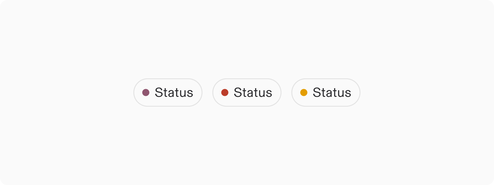
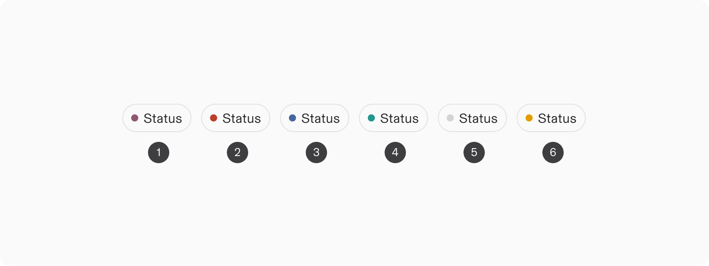
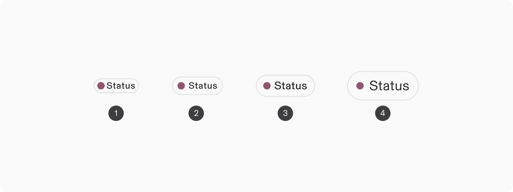
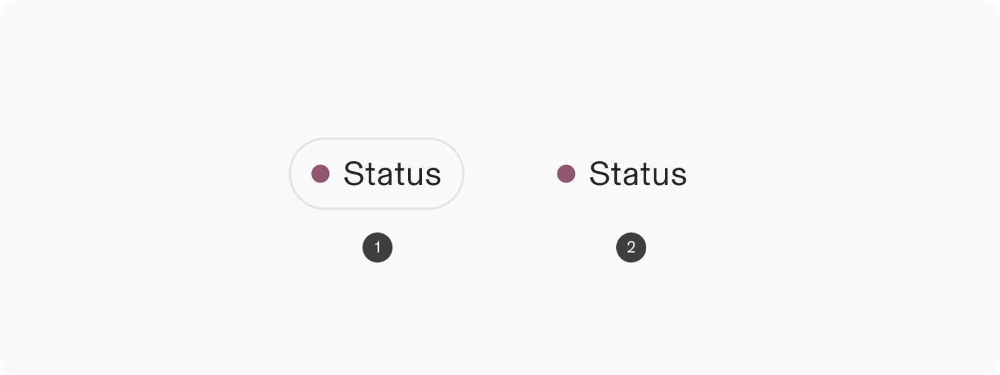
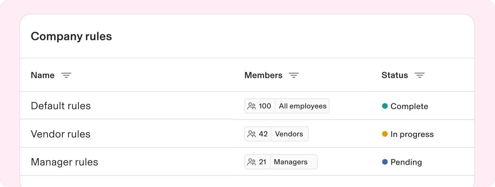
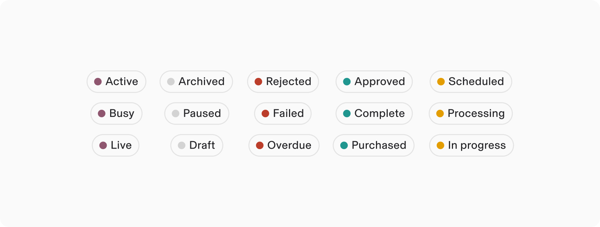

# Status

**Source:** [View in Confluence](https://rippling.atlassian.net/wiki/spaces/RDS/pages/3949428811)  
**Last Synced:** 11/3/2025, 6:10:26 PM  
**Confluence Version:** 4

---

Introduction

A static indicator of real-time state or condition, such as availability, progress, or publication status.

---

# Overview

-   Useful for providing semantic meaning to a status with color
    
-   Great visual affordance for quick recognition of the condition of an entity
    

## Resources

**Type**

**Resource**

**Status**

Design

[Web Component (Figma)](https://www.figma.com/file/ysWbTtfWqhVDHQd1Mg2LQ1/Component-Library-v2?type=design&node-id=968-453&mode=design)

AVAILABLEGreen

Implementation

Web Component (Storybook)

PLANNEDYellow

---

# Specs

## Anatomy

1.  Outline (optional)
    
2.  Color dot
    
3.  Label
    

## Configuration

### Appearance

1.  Primary
    
2.  Error
    
3.  Tertiary
    
4.  Success
    
5.  Disabled
    
6.  Warning
    

### Size

1.  Small
    
2.  Medium
    
3.  Large (default)
    
4.  Extra large
    

### Outline

1.  Outline (default)
    
2.  No outline
    

---

# Usage

### When to use

-   To indicate the real-time state of an item, process, or workflow. It's particularly useful where users need to assess the status of various items at a glance
    
-   Use where space is limited like within data table rows or lists to quickly gauge the condition of multiple items.
    
-   This is particularly beneficial in tables with large data sets because the Status component is performant.
    

### When to use something else

-   For important metadata about an item, use a Label which is great for categorizing, organizing, or highlighting items using keywords that describe them
    

## Guidelines

### Use color to convey semantic meaning

The color of a status component is helpful in providing semantic meaning in combination with the label.

1.  **Primary, Tertiary**: Situationally used for general information sharing without any implied urgency or emotional significance
    
2.  **Surface, On Surface**: Used to denote inactivity or non-current states
    
3.  **Error**: For informing users of errors, failures, or critical issues that impact their experience
    
4.  **Success**: Used to inform the user with positive sentiment, often from a successful outcome
    
5.  **Warning**: Serves as a preemptive alert to situations
    

## Accessibility

Users should be able to:

-   Understand what status the indicator is communicating
