# Table Basic

**Source:** [View in Confluence](https://rippling.atlassian.net/wiki/spaces/RDS/pages/4768104828)  
**Last Synced:** 11/3/2025, 6:10:38 PM  
**Confluence Version:** 9

---

A component for displaying moderately large amounts of data in rows and columns.

[Figma](https://www.figma.com/design/nhtRzieeGFf1tGVWnRxSK3/Web-Component-Library-\(v3\)?node-id=66677-190112&t=wujGO7fDR2aFy1ve-11) | [Storybook](https://pebble.ripplinginternal.com/?path=/docs/components-miscellaneous-tablebasic--docs)

---

# **Overview**

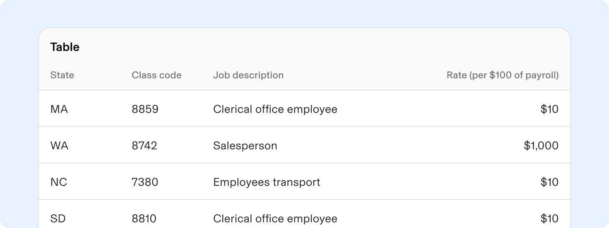

-   Tables organise and display data efficiently.
    
-   They allow users to quickly scan, sort, compare, and act on large data sets.
    
-   They provide valuable insights.
    

---

# **Usage**

### **When to use**

-   TableBasic is a tool that simplifies the navigation and display of large amounts of information, making it easier to compare data across different rows and columns.
    
-   Use Table basic for the following use-cases:
    
    -   **Efficient Navigation:** Simplifies data scanning.
        
    -   **Systematic Organization:** Enhances readability.
        
    -   **Focused Content:** Primarily handles text strings.
        
-   Overall, TableBasic is ideal for displaying multi-column data for better understanding.
    

### **When to use something else**

-   Consider using a **list** or alternative format in these situations:
    
    -   No column headings needed: use the List Item component.
        
    -   Some columns have empty cells: a list can clarify.
        
    -   Improve understanding with effective grouping and hierarchy.
        
    -   Rows and columns are mainly for layout, not data.
        
    -   Long content: a list format enhances readability.
        
-   **Grid**, consider these points:
    
    -   The **Table Basic** option lacks sorting or filtering; use the **Grid** for those features.
        
    -   Choose a grid for editing or interacting with cells like in a spreadsheet.
        
    -   A grid is ideal for rows or columns needing user interaction.
        

---

# **Specs**

## **Anatomy**

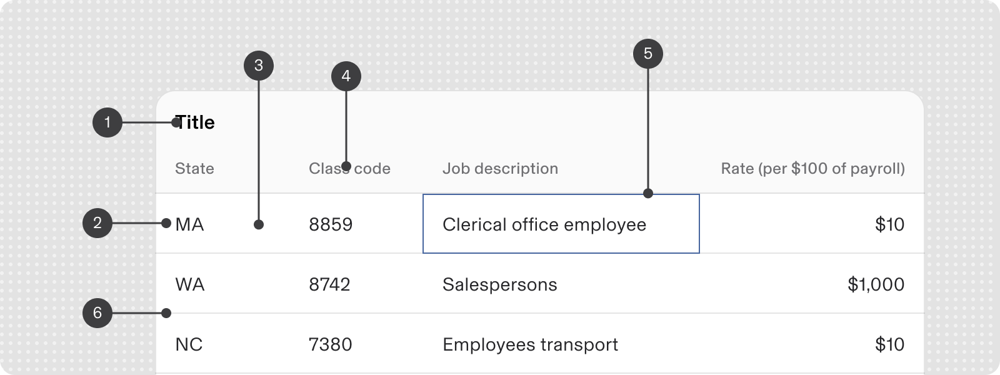

1.  Title
    
2.  Row
    
3.  Column
    
4.  Column Header
    
5.  Cell
    
6.  Divider
    

## **Configuration**

### **Appearance**

#### With Title

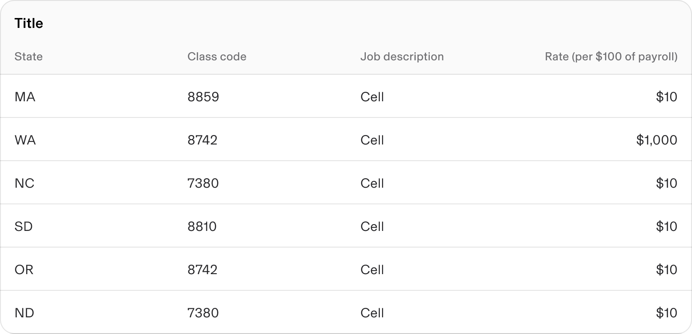

#### Without Title

### **Size**

#### Default Height

The default row height should be 48px.

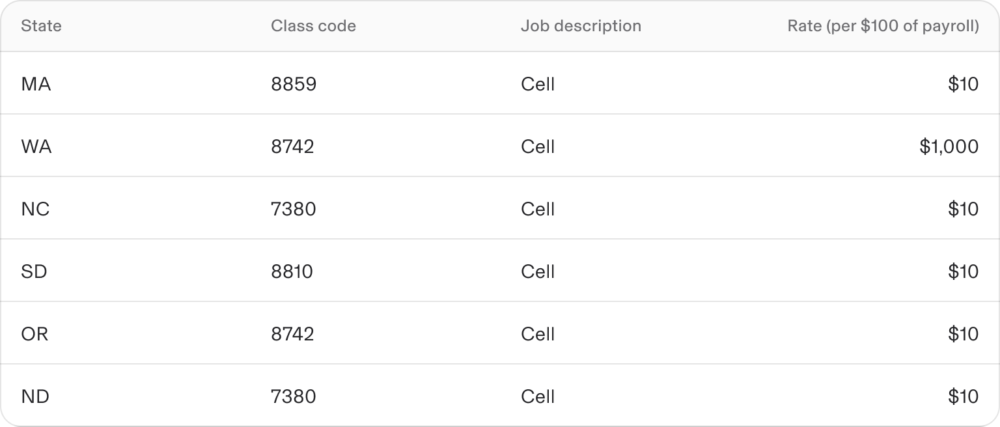

#### Customisable height

The row height can be customised based on the user’s discretion.

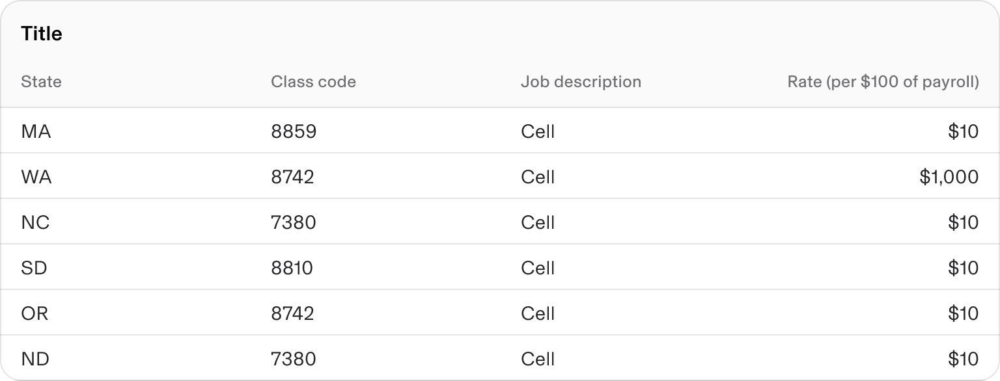

### Content Alignment

#### Left align - textual data

Textual data is consistently left-aligned in a table.

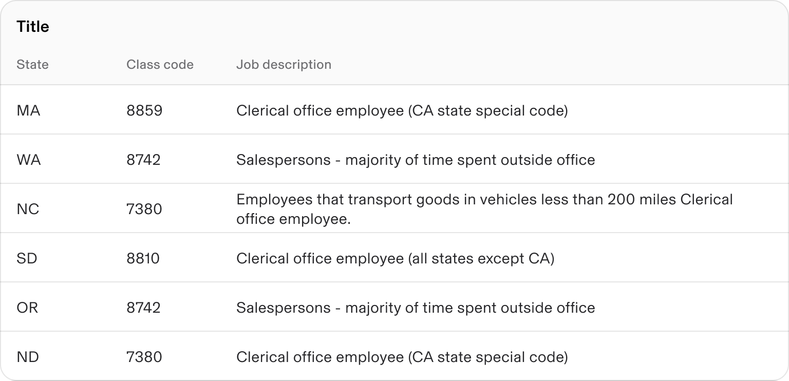

#### Right align - numerical data

-   Numerical data should be right-aligned for easy scanning and comparison.
    
-   Column headers should align with the data.
    

note

Nominal numbers, a number used to identify a person or thing, but not to indicate quantity or value should be left-aligned.

Example: Numbers such as ZIP codes, IP addresses, and phone numbers.

Nominal numbers, a number used to identify a person or thing, but not to indicate quantity or value should be left-aligned.

Example: Numbers such as ZIP codes, IP addresses, and phone numbers.

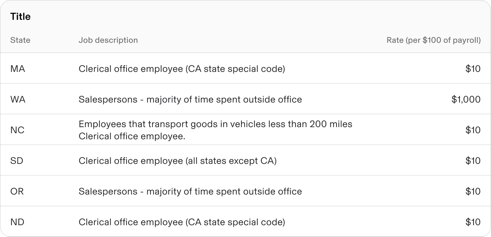

#### Center aligned

Table columns can also be centrally aligned to meet specific use cases.

Use center alignment sparingly.

The suggested approach is to avoid center alignment, except for elements such as checkboxes or star ratings.

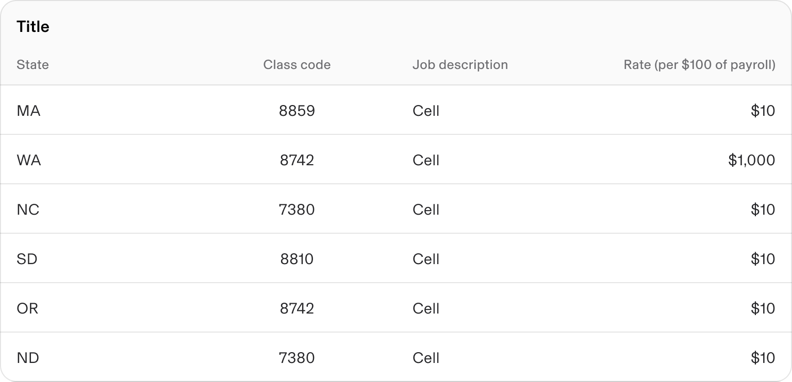

---

# **Guidelines**

### **Column Width**

Column width are adaptable when necessary.  
User can adjust the column width settings to fit the content and available horizontal space.

#### Default / Fluid width

By default all columns are fluid and take equal space of the container

#### Fixed / user defined width

Consumer should be able to define a fixed width for certain columns

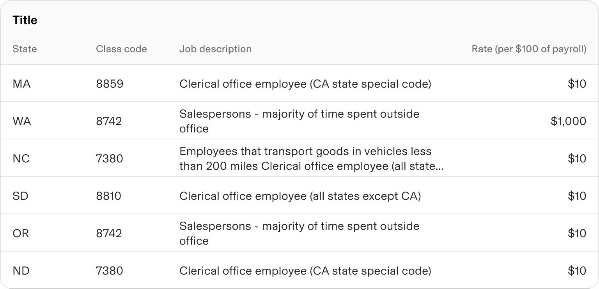

### Text Overflow - Wrapping Behavior

-   Cells expected to hold lengthy strings can wrap content, ensuring nothing is concealed.
    
    -   When rows have wrapped text, make sure to adjust the top and bottom padding of the rows.
        
-   Content truncation can be used when column widths are defined, with full content available in a tooltip.
    

note

Minimise the wrapping or cutting off of cell content whenever feasible.

Minimise the wrapping or cutting off of cell content whenever feasible.

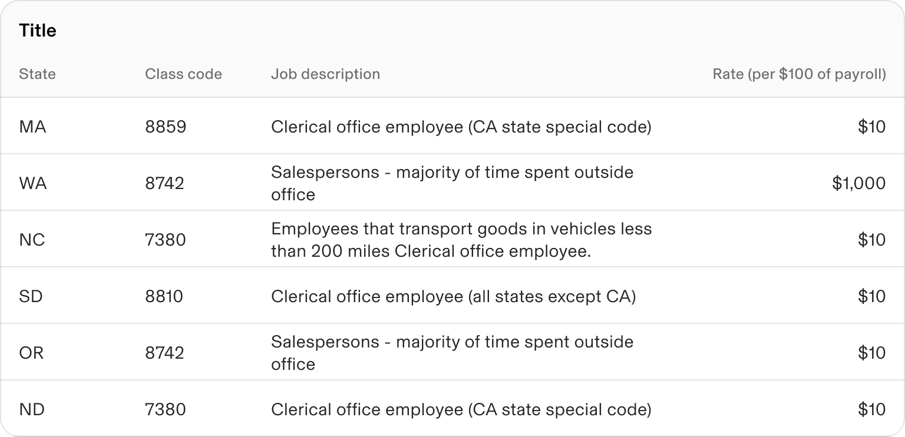

## **Content guidelines**

#### Table title

-   The table title must clearly indicate the data's commonalities and purpose within the UI.
    
-   It should be formatted in sentence-case capitalisation.
    

#### Column titles

-   Column headings should be one or two words that accurately represent the information.
    
-   If a heading is too lengthy, split it into two lines and truncate the rest, showing the full text in a tooltip on hover.
    
-   Format column headings in sentence case.
    

#### Cell content

Cells should convey succinctly to enhance readability and conserve horizontal space.

## **Internationalisation**

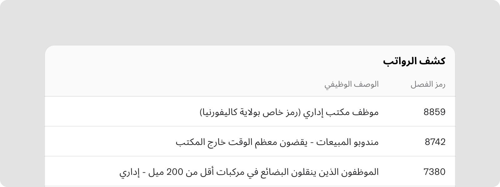

For RTL languages, the table layout is mirrored, with columns ordered and aligned from right to left.

note

Some content types (e.g., file extensions) remain untranslated.

Some content types (e.g., file extensions) remain untranslated.

---

# **Accessibility**

-   Avoid extra controls like links or buttons in table headings.
    
-   Use tables only for structured data, avoiding visual layouts and headless tables.
    
-   Use clear language for column labels to enhance comprehension and aid screen readers.
    

## **Keyboard Navigation**

**Keys**

**Action**

Tab

Places the focus on the next interactive element, which is either a button or a close button.

Space / Enter

Dismissible: If focus is on the close button, dismisses the notice. If focus is on the button, executes the button action/ launch the link.

Right Arrow

Moves focus to the cell on the right. If focus is already on the right-most cell, the focus does not move.

Left Arrow

Moves focus to the cell on the left. If focus is already on the left-most cell, the focus does not move.

Up Arrow

Moves focus to the cell above. If focus is already on the top cell in that column, the focus does not move.

Down Arrow

Moves focus to the cell below. If focus is already on the bottom cell in that column, the focus does not move.

Home

Moves focus to the first cell in the focused row.

End

Moves focus to the last cell in the focused row.

Page Up

For scrollable tables, moves the focus up such that the top visible row becomes the last visible row in the viewport.

Page Down

For scrollable tables, moves the focus down such that the bottom visible row becomes the first visible row in the viewport.

Control/Command + Home

Moves focus to the first cell in the first row.

Control/Command + End

Moves focus to the last cell in the last row.
