# Tabs

**Source:** [View in Confluence](https://rippling.atlassian.net/wiki/spaces/RDS/pages/3995107570)  
**Last Synced:** 11/3/2025, 6:10:31 PM  
**Confluence Version:** 11

---

Labeled controls for alternating between related views within the same page or context.

---

# Overview

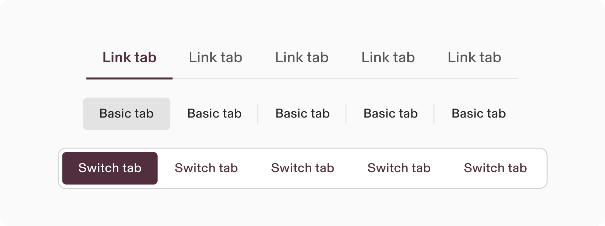

-   Tabs organize groups of related content that are at the same level of hierarchy
    
-   Three types: Link tabs, Switch tabs, Basic tabs
    

## Resources

**Type**

**Resource**

**Status**

Design

[Web Resources (Figma)](https://www.figma.com/file/ysWbTtfWqhVDHQd1Mg2LQ1/v2-Component-Library?type=design&node-id=1120-3443&mode=design)

AvailableGreen

Implementation

[Web Component (Storybook)](https://uikit.ripplinginternal.com/?path=/docs/components-tabs-basic--props)

AvailableGreen

---

# Specs

## Anatomy

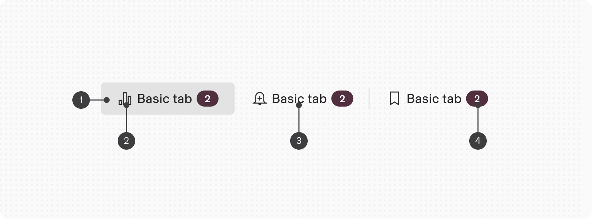

1.  Container
    
2.  Icon (optional)
    
3.  Label
    
4.  Badge (optional)
    

# Configuration

## Appearance

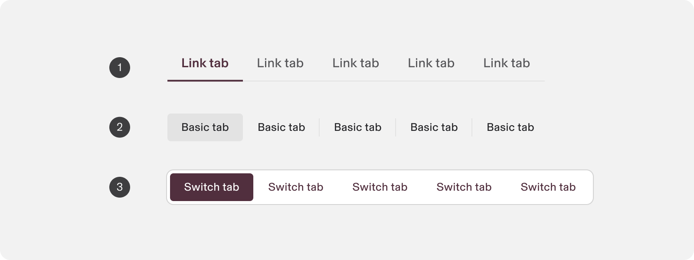

1.  **Link Tabs**: Typically placed at the top level of a page layout or context. They display the related main content areas.
    
2.  **Basic Tabs**: Used within a content area to further separate related content and establish hierarchy.
    
3.  **Switch Tabs**: Used within a content area, typically as a more granular variant of tabs than basic.
    

## Size

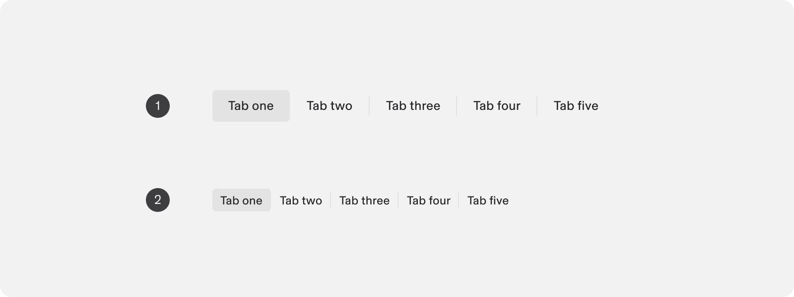

1.  Default
    
2.  Compact
    

## Icons

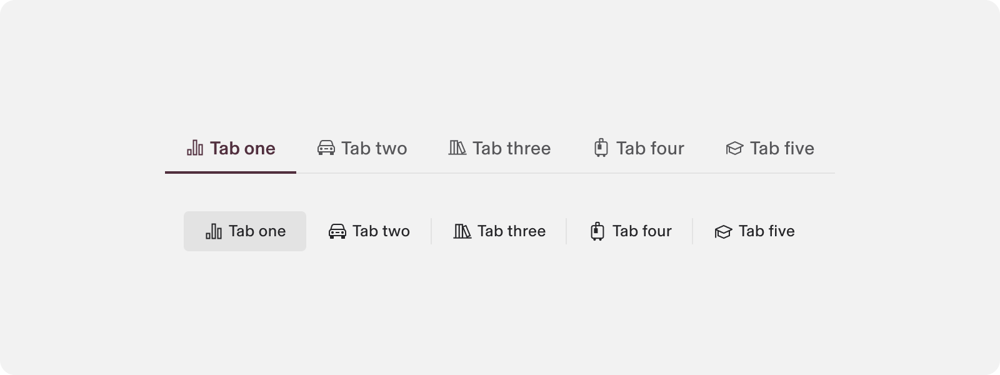

Icons can be included only in the start position of a given tab to aid in glanceability.

## Badge

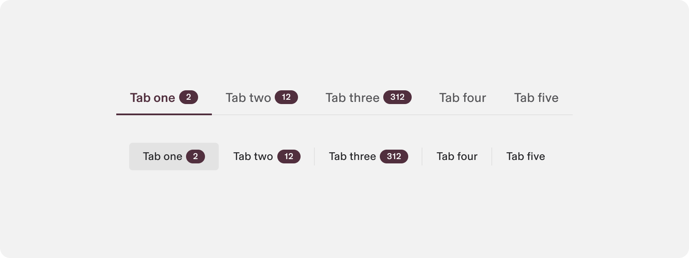

Enumerated badges can be included to indicate a quantity of items, outstanding tasks, or other relevant metrics based on the context.

  
For **vertical link tabs**, badges are **aligned with the label text (inline)**. When the label wraps to multiple lines, the badge flows naturally to the end of the final line rather than remaining fixed to the first.

This ensures cleaner alignment, improved readability, and better support for long or localized labels.

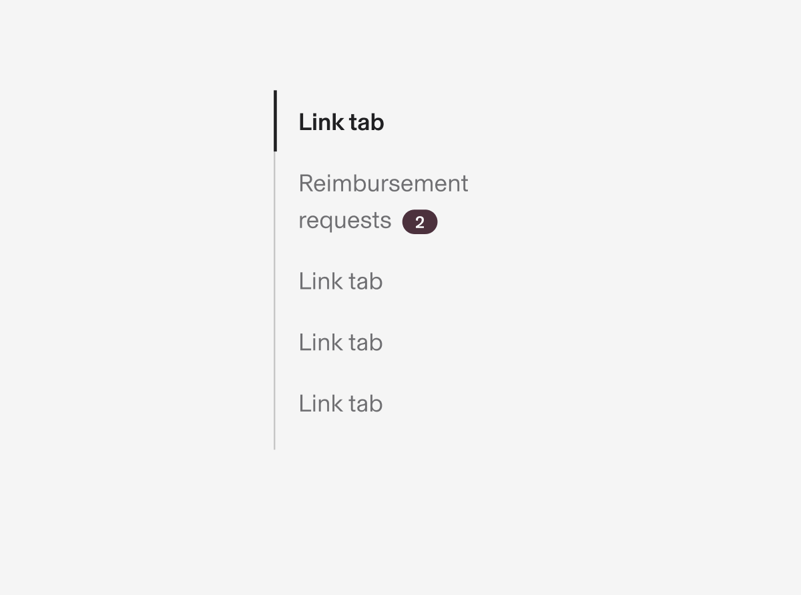

Vertical link tabs with a line break. [Storybook example](https://rippling.design/pebble/?path=/docs/overview-playground--docs&playground=PFRhYnMuTElOSyBkZWZhdWx0QWN0aXZlSW5kZXg9ezN9IGlzVmVydGljYWw%2BCiAgPFRhYgogICAgdGl0bGU9IlRoaXMgaXMgYSByZWFsbHkgbG9uZyB0aXRsZSB0aGF0IGdvZXMgdG8gdHdvIGxpbmVzIgogICAgYmFkZ2U9e3sKICAgICAgdGV4dDogIjMiLAogICAgfX0KICA%2BCiAgICA8ZGl2Pk1lbnUgMSBjb250ZW50PC9kaXY%2BCiAgPC9UYWI%2BCiAgPFRhYiB0aXRsZT0iQWRtaW5zIj4KICAgIDxkaXY%2BTWVudSAyIGNvbnRlbnQ8L2Rpdj4KICA8L1RhYj4KICA8VGFiIHRpdGxlPSJOb3RpZmljYXRpb25zIj4KICAgIDxkaXY%2BTWVudSAyIGNvbnRlbnQ8L2Rpdj4KICA8L1RhYj4KICA8VGFicy5UYWJHcm91cCBkZWZhdWx0QWN0aXZlSW5kZXg9ezJ9IHRpdGxlPSJOZXN0ZWQgQ2hpbGQiPgogICAgPFRhYiB0aXRsZT0iQ2hpbGQgMSI%2BCiAgICAgIDxkaXY%2BQ2hpbGQgMSBjb250ZW50PC9kaXY%2BCiAgICA8L1RhYj4KICAgIDxUYWIgdGl0bGU9IkNoaWxkIDIiPgogICAgICA8ZGl2PkNoaWxkIDIgY29udGVudDwvZGl2PgogICAgPC9UYWI%2BCiAgICA8VGFiIHRpdGxlPSJDaGlsZCAzIj4KICAgICAgPGRpdj5DaGlsZCAzIGNvbnRlbnQ8L2Rpdj4KICAgIDwvVGFiPgogICAgPFRhYiB0aXRsZT0iQ2hpbGQgNCI%2BCiAgICAgIDxkaXY%2BQ2hpbGQgNCBjb250ZW50PC9kaXY%2BCiAgICA8L1RhYj4KICA8L1RhYnMuVGFiR3JvdXA%2BCiAgPFRhYiB0aXRsZT0iTWVudSA1Ij4KICAgIDxkaXY%2BTWVudSA1IGNvbnRlbnQ8L2Rpdj4KICA8L1RhYj4KICA8VGFiIHRpdGxlPSJNZW51IDYiPgogICAgPGRpdj5NZW51IDYgY29udGVudDwvZGl2PgogIDwvVGFiPgogIDxUYWIgdGl0bGU9Ik1lbnUgNyI%2BCiAgICA8ZGl2Pk1lbnUgNyBjb250ZW50PC9kaXY%2BCiAgPC9UYWI%2BCjwvVGFicy5MSU5LPjsK)

In Figma, badges are shown **top-aligned to the label** as a visual approximation due to Auto Layout limitations. The production implementation uses [**true inline alignment**](https://rippling.design/pebble/?path=/docs/overview-playground--docs&playground=PFRhYnMuTElOSyBkZWZhdWx0QWN0aXZlSW5kZXg9ezN9IGlzVmVydGljYWw%2BCiAgPFRhYgogICAgdGl0bGU9IlRoaXMgaXMgYSByZWFsbHkgbG9uZyB0aXRsZSB0aGF0IGdvZXMgdG8gdHdvIGxpbmVzIgogICAgYmFkZ2U9e3sKICAgICAgdGV4dDogIjMiLAogICAgfX0KICA%2BCiAgICA8ZGl2Pk1lbnUgMSBjb250ZW50PC9kaXY%2BCiAgPC9UYWI%2BCiAgPFRhYiB0aXRsZT0iQWRtaW5zIj4KICAgIDxkaXY%2BTWVudSAyIGNvbnRlbnQ8L2Rpdj4KICA8L1RhYj4KICA8VGFiIHRpdGxlPSJOb3RpZmljYXRpb25zIj4KICAgIDxkaXY%2BTWVudSAyIGNvbnRlbnQ8L2Rpdj4KICA8L1RhYj4KICA8VGFicy5UYWJHcm91cCBkZWZhdWx0QWN0aXZlSW5kZXg9ezJ9IHRpdGxlPSJOZXN0ZWQgQ2hpbGQiPgogICAgPFRhYiB0aXRsZT0iQ2hpbGQgMSI%2BCiAgICAgIDxkaXY%2BQ2hpbGQgMSBjb250ZW50PC9kaXY%2BCiAgICA8L1RhYj4KICAgIDxUYWIgdGl0bGU9IkNoaWxkIDIiPgogICAgICA8ZGl2PkNoaWxkIDIgY29udGVudDwvZGl2PgogICAgPC9UYWI%2BCiAgICA8VGFiIHRpdGxlPSJDaGlsZCAzIj4KICAgICAgPGRpdj5DaGlsZCAzIGNvbnRlbnQ8L2Rpdj4KICAgIDwvVGFiPgogICAgPFRhYiB0aXRsZT0iQ2hpbGQgNCI%2BCiAgICAgIDxkaXY%2BQ2hpbGQgNCBjb250ZW50PC9kaXY%2BCiAgICA8L1RhYj4KICA8L1RhYnMuVGFiR3JvdXA%2BCiAgPFRhYiB0aXRsZT0iTWVudSA1Ij4KICAgIDxkaXY%2BTWVudSA1IGNvbnRlbnQ8L2Rpdj4KICA8L1RhYj4KICA8VGFiIHRpdGxlPSJNZW51IDYiPgogICAgPGRpdj5NZW51IDYgY29udGVudDwvZGl2PgogIDwvVGFiPgogIDxUYWIgdGl0bGU9Ik1lbnUgNyI%2BCiAgICA8ZGl2Pk1lbnUgNyBjb250ZW50PC9kaXY%2BCiAgPC9UYWI%2BCjwvVGFicy5MSU5LPjsK) between text and badge.

## Orientation

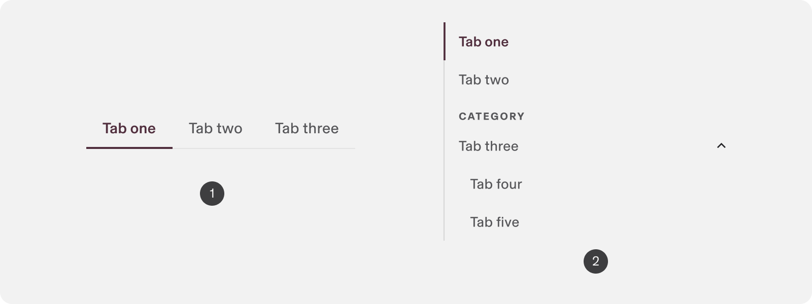

1.  **Horizontal** — Used for primary navigation across top-level content areas within a page. Ideal when tab labels fit comfortably on one line.
    
2.  **Vertical** — Used for navigation in a left rail. Supports longer or wrapping labels and can include badges or nested sections. _Only available for “Link Tabs” appearance_. Please note: if you’re looking for guidance on how text wrapping with a badge works, see [https://rippling.atlassian.net/wiki/spaces/RDS/pages/3995107570/Tabs#Badge](https://rippling.atlassian.net/wiki/spaces/RDS/pages/3995107570/Tabs#Badge) .
    

The vertical orientation is only available for the Link appearance of Tabs. Changing the orientation with Basic tabs will have no effect. Vertical tabs can be nested up to 2 levels deep.

### Full width

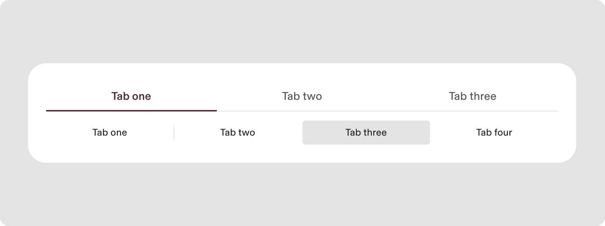

Tabs can become fluid and assume the width of a parent container instead of hugging the content.

---

## Usage

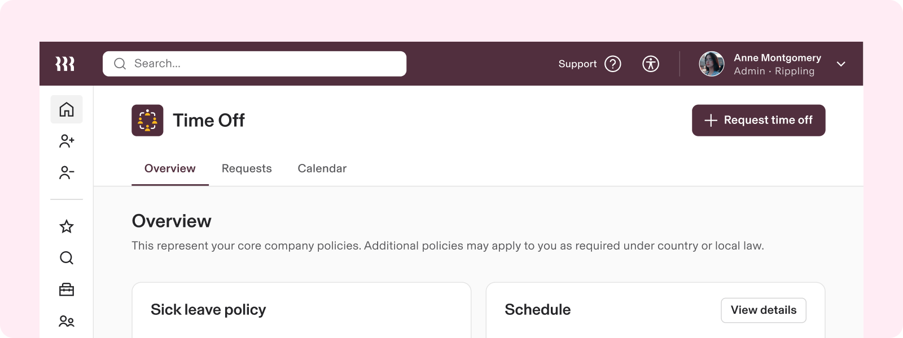

### When to use

-   To organize groups of related content that are at the same level of hierarchy
    

### When to use something else

-   To make a selection, much like a radio group, consider a Segmented Control
    
-   To mark the nested navigational context of a user’s location within an app, use Breadcrumbs
    

## Guidelines

### Using tabs versus segmented controls

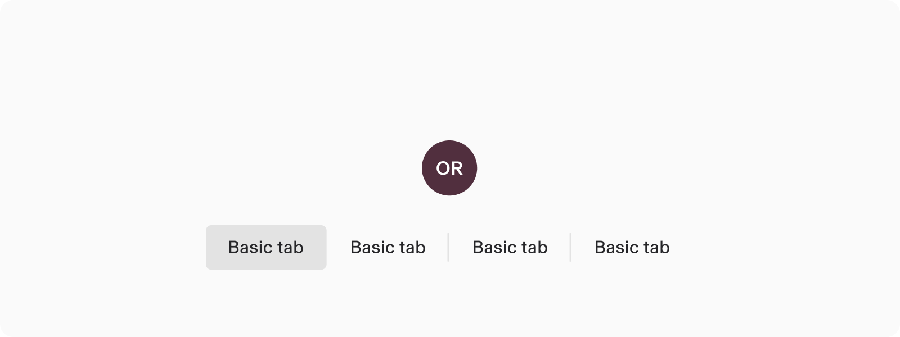

Choosing between Segmented controls and tabs depends on the purpose of the content being presented. Segmented Controls are akin to radio buttons grouped together; they are best used for making a single choice from a few closely related options. This control is ideal for filtering or sorting content within the same view without navigating away.

On the other hand, tabs are suited for organizing and navigating between different views or contexts of related content, allowing users to switch views without losing their place. Tabs imply the presence of separate content areas that are parallel in nature, whereas Segmented Controls are for selecting a single option to alter the current view.

The primary mnemonic: Is the control altering the content within the current view (segmented control) or changing it entirely (tabs)?

## Content standards

### Write in sentence case

[Like all in-product content](https://rippling.atlassian.net/wiki/spaces/RDS/pages/3774153201/Guidelines#3.-Use-sentence-case-for-everything-except-branded-terms) at Rippling, tab labels are written in sentence case.

# Accessibility

Users should be able to: 

-   Invoke actions or navigation to a new destination with assistive technologies
    

### Labeling

The accessibility label for a tab ideally comes from the visible label text in the button. If the label text is ambiguous, provide more descriptive aria text to ensure clarity.

### Keyboard Navigation

**Keys**

**Action**

Tab

Focus lands on the first non-disabled item in the tab menu

Space / Enter

Activates the focused navigation destination

Arrows

Allows navigation through the tab menu items
