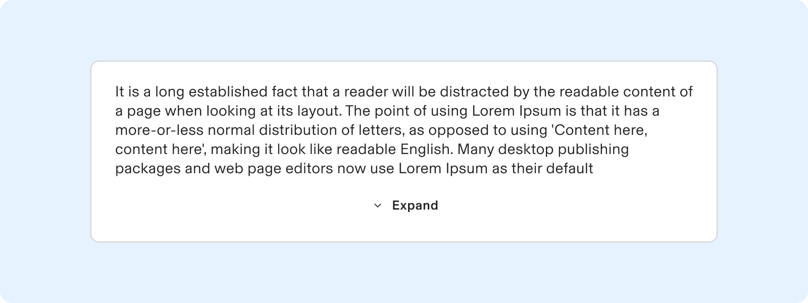
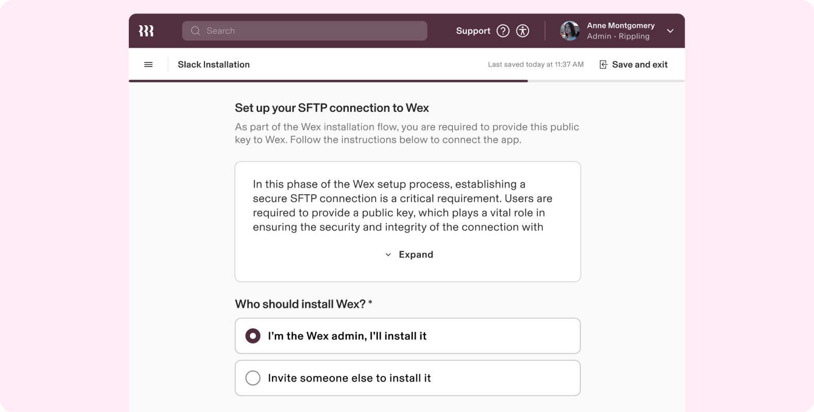
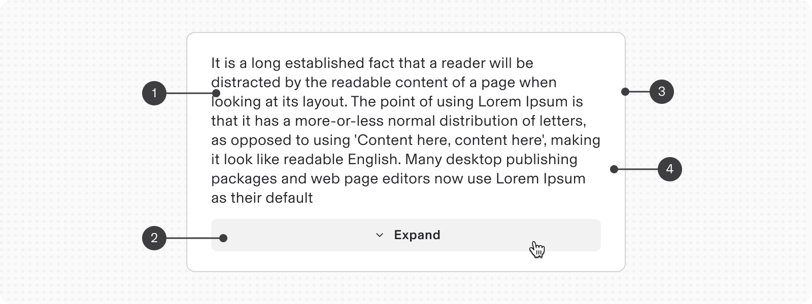
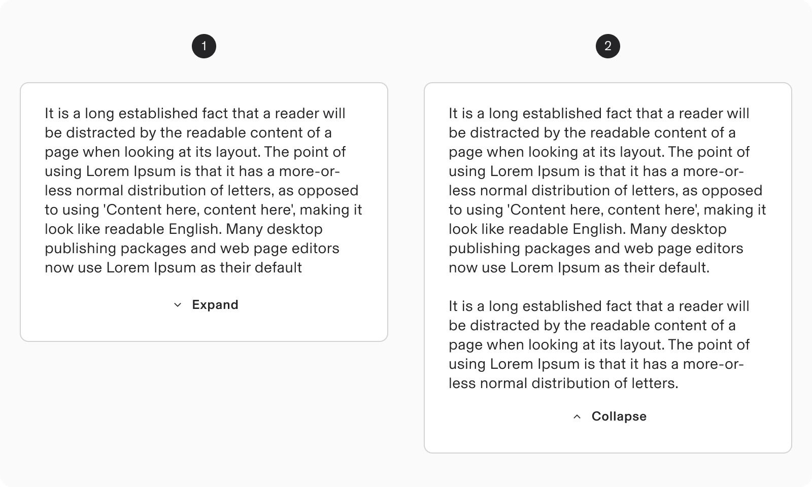
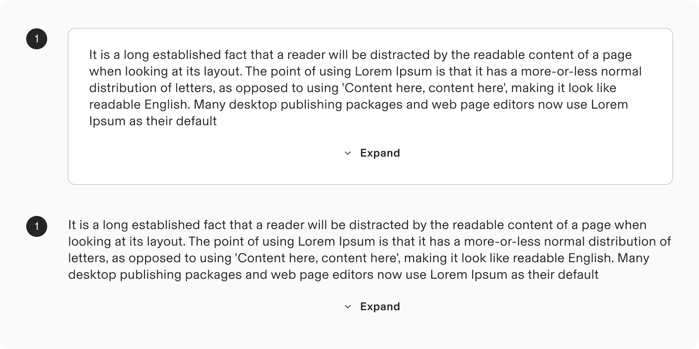
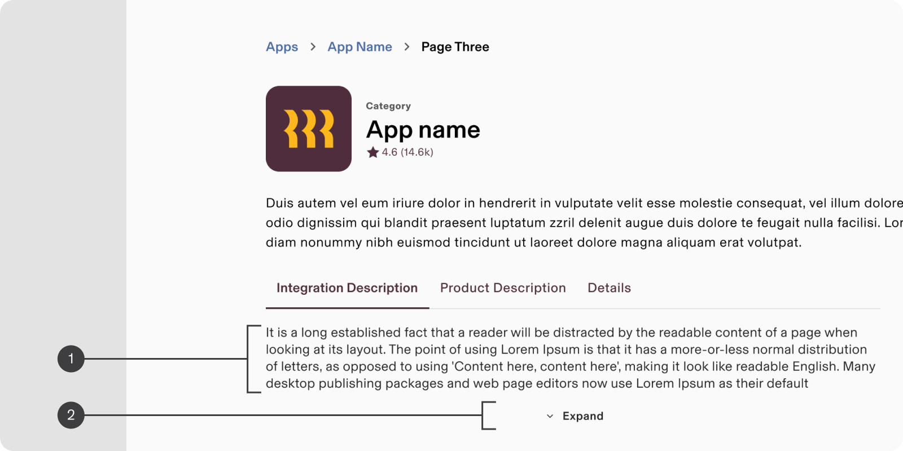
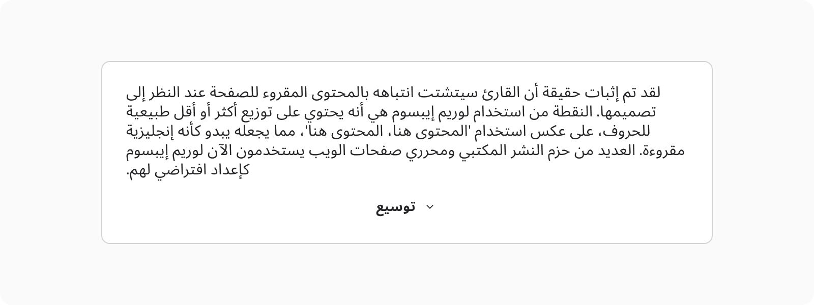

# Text Clip component - Design Systems

**Source:** [View in Confluence](https://rippling.atlassian.net/wiki/spaces/RDS/pages/4819517470)  
**Last Synced:** 11/3/2025, 6:10:41 PM  
**Confluence Version:** 8

---

A text clip component displays extensive text in a compact area, with an option to expand for full viewing.

A text clip component displays extensive text in a compact area, with an option to expand for full viewing.

[Figma](https://www.figma.com/design/nhtRzieeGFf1tGVWnRxSK3/Web-Component-Library-\(v3\)?node-id=69442-51552&t=4VyKQOD0knps3Fx0-11) | [Storybook](https://pebble.ripplinginternal.com/?path=/docs/components-expandable-textclip--docs)

---

# **Overview**

-   The Text Clip component displays lengthy text within a small space by expanding/collapsing.
    
-   Users can expand to view the complete content.
    
-   Ideal for content previews and summaries.
    
-   Useful in situations where space is limited but more information is needed.
    

---

# **Usage**

### **When to use**

-   Use the Text Clip component when you need to display a large block of text in a limited space.
    
-   Use Text Clips to offer users a preview of longer content without displaying the entire piece, thus preventing the page's other content from being pushed down.
    

### **When to use something else**

-   Consider using expansion panel if you have multiple sections of content that need individual expansion and collapse functionality.
    
-   Use a tooltip for very brief content that only needs to appear on hover.
    

---

# **Specs**

## **Anatomy**

1.  Body Text
    
2.  CTA Button (expand / collapse)
    
3.  Border
    
4.  Card Container
    

## **Configuration**

### **States**

1.  Collapsed (default)
    
2.  Expanded
    

The expand/collapse CTA uses a nested Button component, adhering to all defined states for the button component.

### Appearance

1.  Card theme - with borders (default)
    
2.  No Card theme - without border
    

### **Size**

**Width**: The Text Clip’s width should be fluid, adapting responsively to the user-defined layout or grid to ensure design consistency.

**Height**: Allow users to specify a maximum height (of collapsed state) to display a content overview effectively, ensuring it fits well within the layout and provides a clear preview. Default min height is 160px.

---

# **Guidelines**

### Using no border (card-less layout)

1.  **Initial Context**
    
    -   Ensure that the initial view of the snippet provides enough context to understand the content before expansion.
        
2.  **Visual Indicators**
    
    -   Clearly indicate the expand/collapse functionality with a visual cue, such as an arrow or plus/minus icon.
        

## **Content guidelines**

-   The visible content at the top should provide clear context.
    
-   Use headings and bullet points within the expanded content for clarity and readability.
    
-   Avoid overloading the snippet with excessive text to keep it user-friendly.
    

## **Internationalisation**

-   Textual content adheres to alignemnt of the RTL languages.
    
-   Ensure that the expand/collapse icons and text adapt correctly to right-to-left (RTL) languages.
    

---

# **Accessibility**

-   Provide ARIA labels to indicate the state of the component (expanded or collapsed).
    
-   Ensure that the expand/collapse functionality is operable via screen readers.
    
-   Ensure smooth transition and focus management when the content is expanded.
    

## **Keyboard Navigation**

**Keys**

**Action**

Tab

Focus on the expand/collapse button

Space / Enter

Toggle the state
