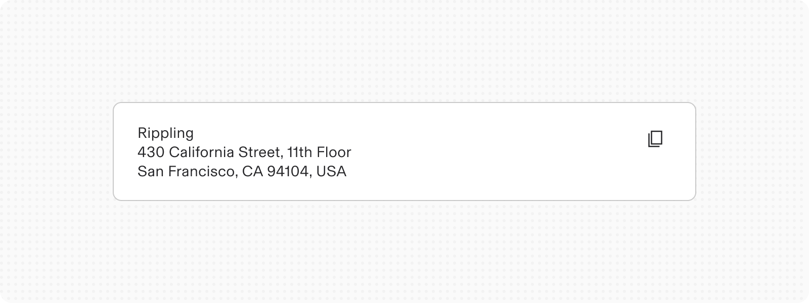
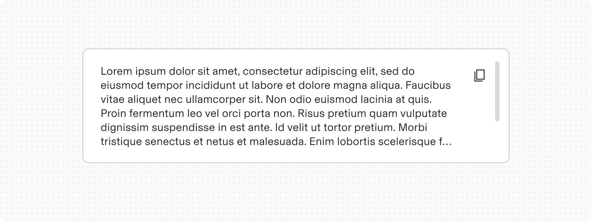
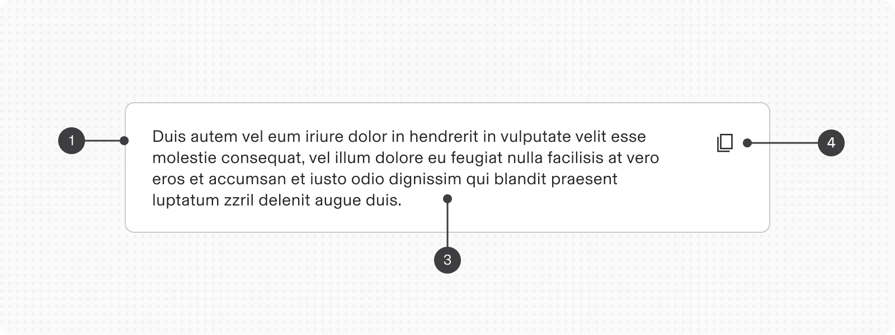
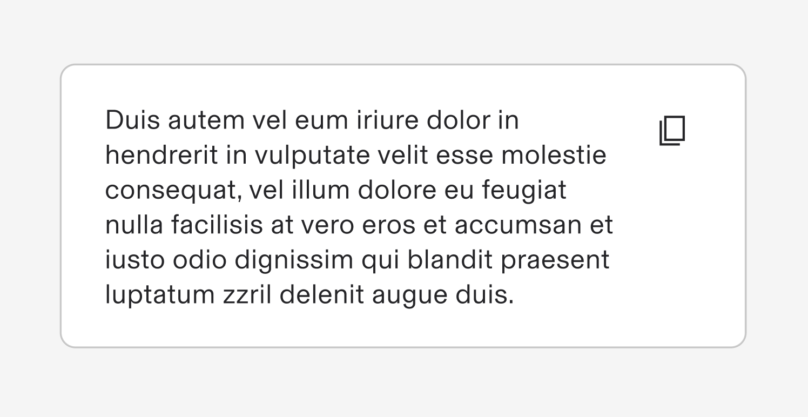
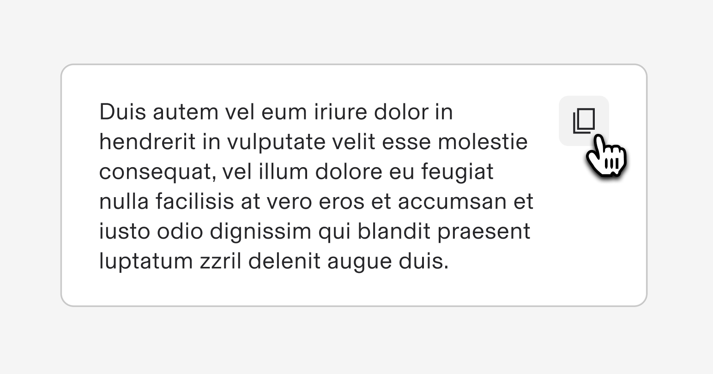
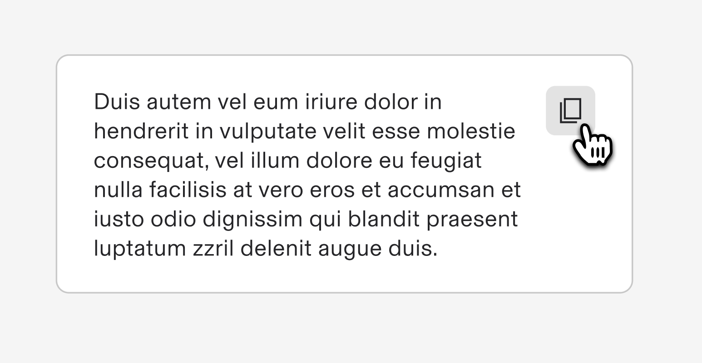
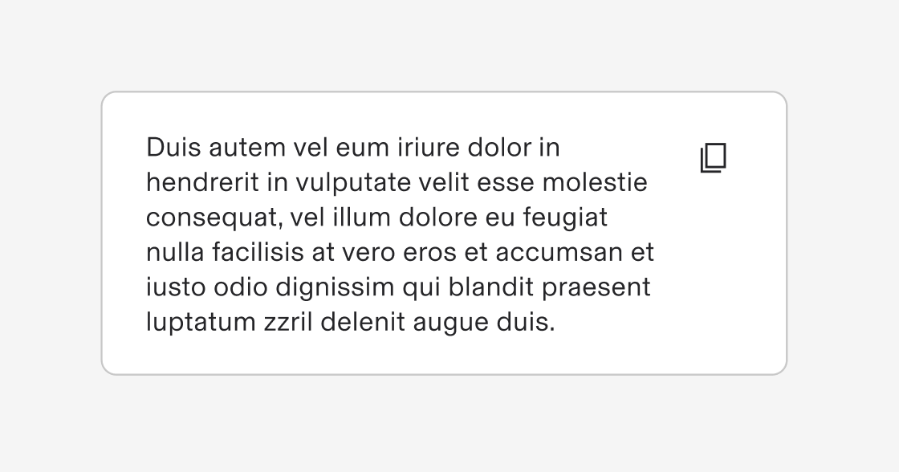
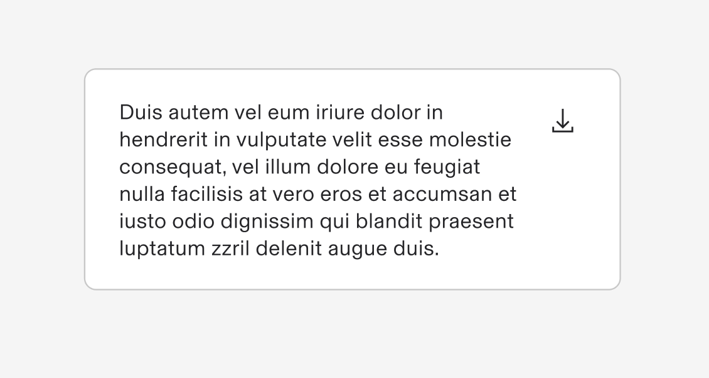
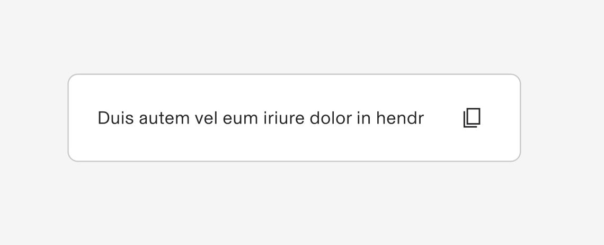

# Text Snippet

**Source:** [View in Confluence](https://rippling.atlassian.net/wiki/spaces/RDS/pages/4767940630)  
**Last Synced:** 11/3/2025, 6:10:45 PM  
**Confluence Version:** 5

---

Displays a snippet of text content which can be copied to clipboard or downloaded by the user

[Figma](https://www.figma.com/design/nhtRzieeGFf1tGVWnRxSK3/Web-Component-Library-\(v3\)?node-id=66574-100880) [Storybook](https://pebble.ripplinginternal.com/?path=/docs/components-textsnippet-copy--docs)

---

# Overview

The Text Snippet component allows users to view a piece of text content that can be copied to the clipboard or downloaded as a file. This functionality is useful for sharing, saving, or using text in different contexts without manual copying.

# Usage

## When to use

-   When users need to quickly copy text/code to use elsewhere.
    
-   When users need to download text for offline access or archival.
    

## When not to use

-   When text is highly sensitive and should not be easily shared.
    
-   When text is too large or complex to be useful in plain text form.
    

## Interactions

1.  **Copy Action:** On clicking the copy icon, the text is copied to the clipboard. A confirmation tooltip or message may appear.
    
2.  **Download Action:** On clicking the download icon, the text is downloaded as a `.txt` file.
    
3.  Multi-line text is scrollable inside the container
    

# Specs

## Anatomy

1.  **Container:** Holds the text and action icons.
    
2.  **Text Area:** Displays the text content.
    
3.  **Copy Icon:** Allows users to copy the text to the clipboard.
    

## States

**Type**

**Purpose**

**Visual representation**

Default

Normal display with icons visible.

Hover

Icons highlighted when hovered over.

Active

Icon changes state when clicked.

## Variants

**Type**

**Purpose**

**Visual representation**

Multi-line with Copy

When a text snippet needs to be copied quickly

Multi-line with Download

When a text snippet needs to be downloaded as a text file `.txt`

Single line

When a single-line text snippet needs to be copied or downloaded

# Content guidelines

-   Text should be concise and clear, ensuring users understand what they are copying or downloading.
    
-   Include context or labels if necessary to clarify the purpose of the text.
    
-   Ensure text is formatted correctly for readability.
    

## Accessibility

-   Ensure icons have descriptive aria-labels or alt text for screen readers.
    
-   Provide keyboard support for all interactive elements.
    
-   Use sufficient color contrast for text and icons to be readable by users with visual impairments.
    
-   Include focus indicators for users navigating via keyboard.
