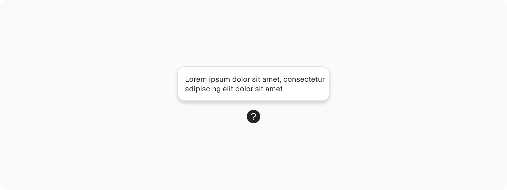
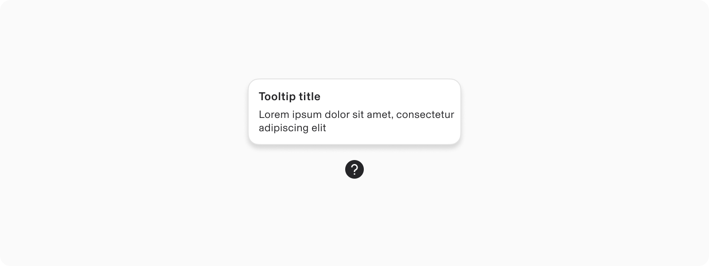
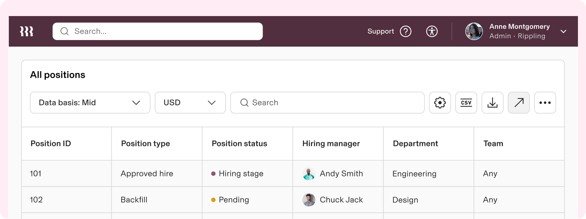
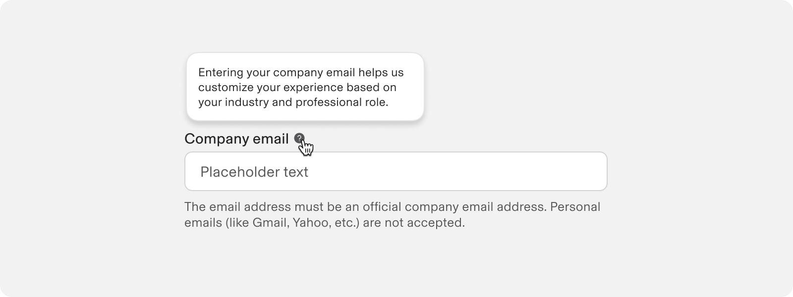
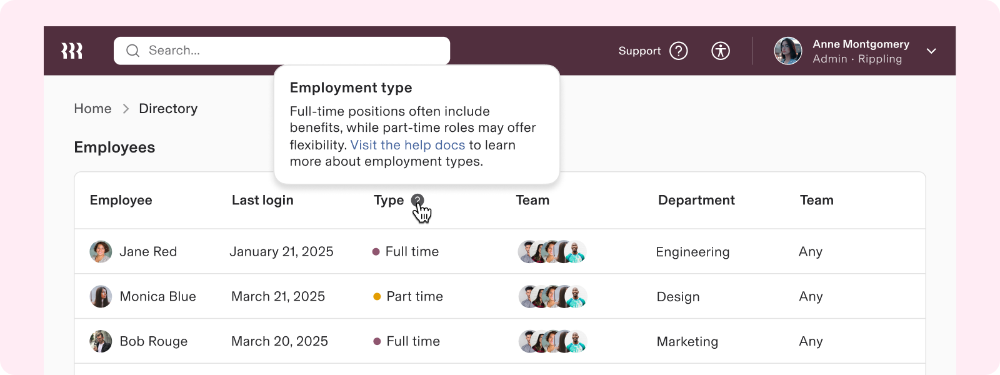
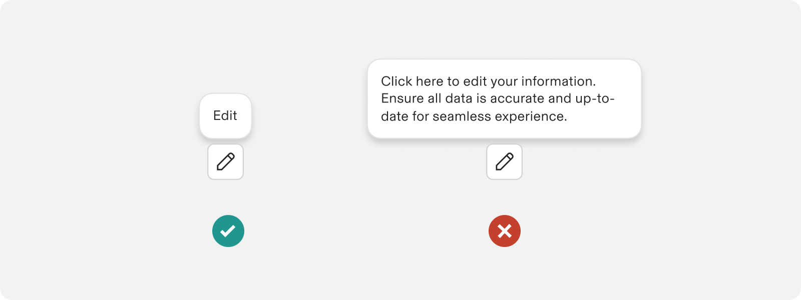

# Tooltip

**Source:** [View in Confluence](https://rippling.atlassian.net/wiki/spaces/RDS/pages/4020109313)  
**Last Synced:** 11/3/2025, 6:10:49 PM  
**Confluence Version:** 20

---

A supportive floating text box that offers contextual details about an associated element when focused on or hovered over.

---

# Overview

-   Use tooltips to describe elements or actions of icon buttons
    
-   To describe the function of an element when it is ambiguous
    
-   To provide supplementary, non-critical information about UI elements
    

## Resources

**Type**

**Resource**

**Status**

Design

[Web Resources (Figma)](https://www.figma.com/file/ysWbTtfWqhVDHQd1Mg2LQ1/v2-Component-Library?type=design&node-id=1641-2390&mode=design)

AvailableGreen

Implementation

[Web Component (Storybook)](https://uikit.ripplinginternal.com/?path=/docs/components-miscellaneous-tip--props)

AvailableGreen

---

# Specs

## Anatomy

1.  Title (optional)
    
2.  Content
    
3.  Container
    

## Configuration

### Default tooltips

A plain tooltip briefly describe a UI element. They're best used for labelling UI elements with no text, like icon-only buttons and UI elements that might be ambiguous.

### Tooltip title

Tooltips can optionally contain a title to provide hierarchy for longer text content like definitions or explanations.

---

# Usage

### When to use

-   Use tooltips to add additional context to a button or other UI element
    
-   Use tooltips to describe elements or actions of icon buttons
    

### When to use something else

-   When action from the user is required or the information is critical, use a Modal
    

## Guidelines

Icon Button Tooltiptrue

### Don't use tooltips to communicate critical information

A tooltip should only be used to provide supplementary context or hints to the message shown in help text. For example, in a scenario where a user is entering a business email, the crucial information would be to state the email address requirements. Supplementary context could be information about how the email is being used (it’s helpful, but not crucial to know).

### Ensure actions in tooltips aren’t critical

Embedding actions within tooltips is discouraged due to accessibility concerns. Critical actions should not be placed within tooltips, as they can easily be missed by users, particularly those with visual impairments or who rely on assistive technologies. Instead, important actions should be displayed in a modal dialog that interrupts the user flow, ensuring that all users are given the opportunity to notice and interact with these actions deliberately.

### Writing effective tooltips

Per standard content guidelines, omit periods at the end of single declarative sentences and write everything in sentence case except for branded terms. Tooltips should be as concise and clear as possible. Keep the text to 1 or 2 short sentences (ideally a few words or less). If the information you need to communicate is longer than that, it’s a good indication that the design needs reworked, simplified, or displayed on the page.

---

# Accessibility

## Keyboard Navigation

**Keys**

**Action**

Tab

Shows tooltip on when focus lands on associated trigger element
